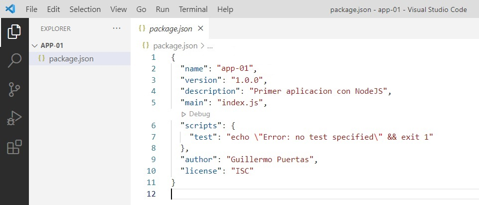
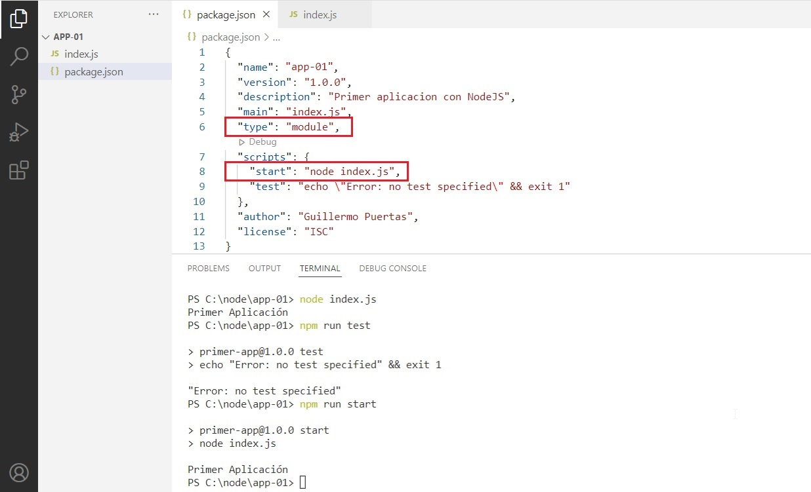
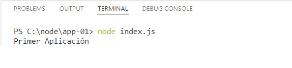
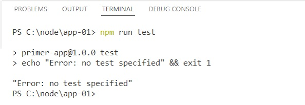
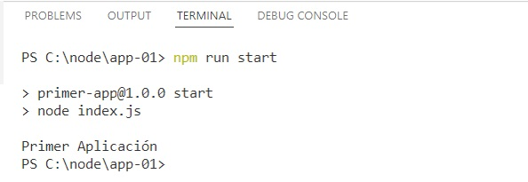
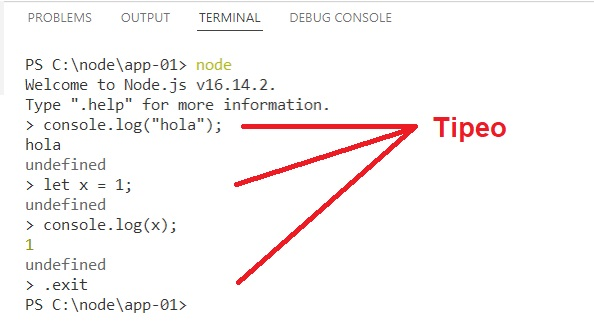

# PRIMER APLICACION CON NODE
Vamos a crear la primer aplicación con NodeJs, desde la línea de comandos, luego modificar el archivo `package.json` y ejecutar la aplicación.

<!-- 
#include "00-pre-requisitos.md"
-->
## Prerequisitos
Es necesario tener instalado lo siguiente:

- [Visual Studio Code](https://code.visualstudio.com/) instalado en la computadora (versión 1.66.2 o superior).

    ```doscon
    c:\>code -v
    1.66.2
    dfd34e8260c270da74b5c2d86d61aee4b6d56977
    x64
    ```


- [Node.js®](https://nodejs.org/en/) entorno de ejecución para JavaScript construido con V8, motor de JavaScript de Chrome (versión 16.14.2 LTS o superior).

    ```doscon
    c:\>node -v
    v16.14.2
    ```

- [NPM](https://www.npmjs.com/) Node Package Manager (versión 8.6.0 o superior)

    ```doscon
    c:\>npm -v
    8.6.0

    npm install npm@latest -g
    ```
    
<!--- 
    - [C# extension for Visual Studio Code](https://marketplace.visualstudio.com/items?itemName=ms-vscode.csharp)
-->
---
## Paso 1: Crear la carpeta de la aplicacion

Abrimos una ventana de Consola (powershell) y nos dirijimos a la carpeta raiz de la unidad en donde queremos crear la app.

Creamos una carpeta, por ejemplo **c:\node\app-01**.

```doscon
C:\>md node
C:\>cd node
C:\node>md app-01
C:\node>cd app-01
C:\node\app-01>
```
---
## Paso 2: Ejecutar npm init
Estando parados en la carpeta **c:\node\app-01** ejecutamos el comando **npm init**.

Completamos sólo los atributos _"package name", "description"_ y _"author"_.

```doscon
C:\node\app-01>npm init
This utility will walk you through creating a package.json file.
It only covers the most common items, and tries to guess sensible defaults.

See `npm help init` for definitive documentation on these fields
and exactly what they do.

Use `npm install <pkg>` afterwards to install a package and
save it as a dependency in the package.json file.

Press ^C at any time to quit.
package name: (app-01) app-01
version: (1.0.0)
description: Primer aplicacion con NodeJS
entry point: (index.js)
test command:
git repository:
keywords:
author: Guillermo Puertas
license: (ISC)
About to write to C:\node\app-01\package.json:

{
  "name": "app-01",
  "version": "1.0.0",
  "description": "Primer aplicacion con NodeJS",
  "main": "index.js",
  "scripts": {
    "test": "echo \"Error: no test specified\" && exit 1"
  },
  "author": "Guillermo Puertas",
  "license": "ISC"
}

Is this OK? (yes)
C:\node\app-01>
```
---
## Paso 3: Abro el Visual Studio
Luego abro el **Visual Studio Code** en esa carpeta, para comenzar a editar el codigo.
```doscon
C:\node\app-01>code .
```



---
## Paso 4: Agrego el archivo index.js
Agrego un archivo `index.js` que es el que se va a ejecutar como punto de entrada de la aplicacion. 
Esta indicado en el `package.json`.

Le agrego el siguiente codigo.

```JavaScript
//
// Ingresar el codigo debajo.
//
console.log("Primer Aplicación");
```

---
## Paso 5: Modifico el archivo package.json
Modifico el archivo `package.json` agregándole el "type", y un "script".

> Cuando se tiene "type": "module" en el archivo package.json habilita los módulos ES6. El código fuente debe usar la sintaxis import. Cuando no tiene, se debe usar la sintaxis require(). 





---
## Paso 6: Ejecuto la aplicación
Para ejecutar la aplicación abro una Terminal desde el Visual Studio Code y ejecuto los siguientes comandos.
```doscon
C:\node\app-01>node index.js
```




```doscon
C:\node\app-01>npm run test
```



```doscon
C:\node\app-01>npm run start
```



---
## Paso 7: Probemos el node en modo REPL
Para ejecutar node tipeamos node desde la terminal. Eso nos permite ingresar en el modo REPL.
>**Nota**: REPL significa **R**ead **E**valuate **P**rint **L**oop, y es un entorno de lenguaje de programación (básicamente una ventana de consola) que toma una sola expresión como entrada del usuario y devuelve el resultado a la consola después de la ejecución. La sesión REPL proporciona una manera conveniente de probar rápidamente código JavaScript simple.

```doscon
C:\node\app-01>node
```



