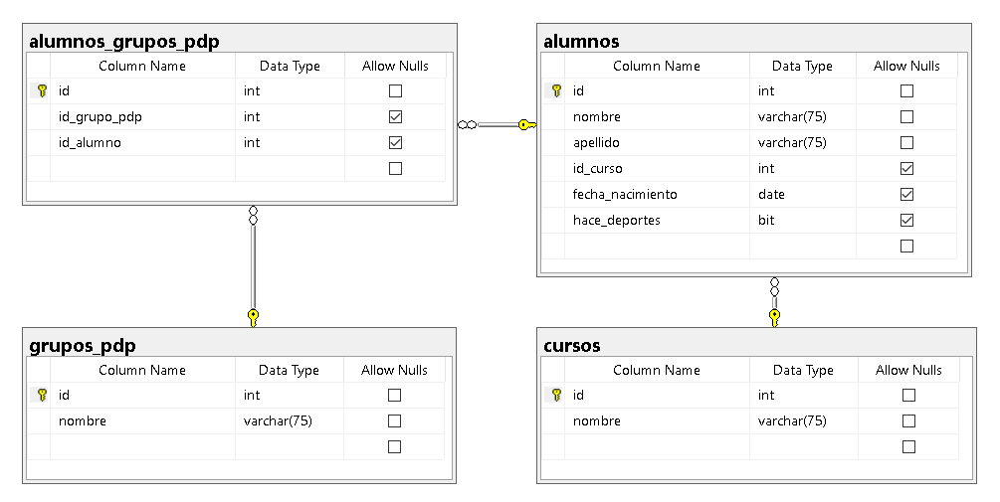
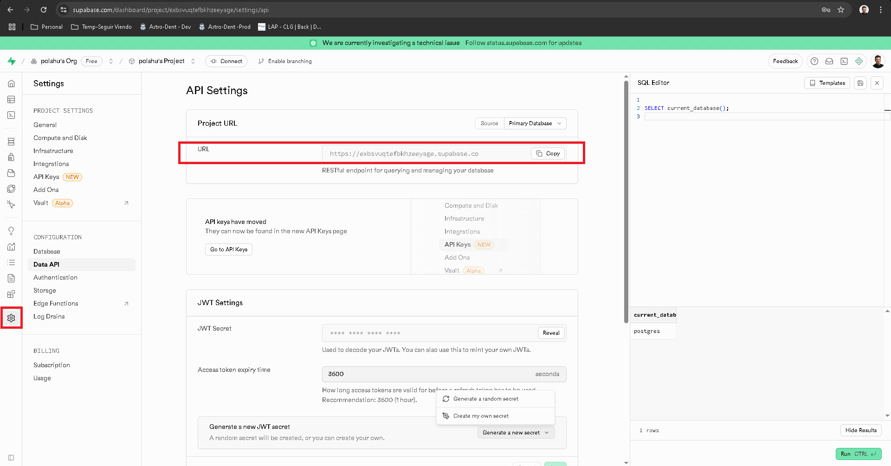
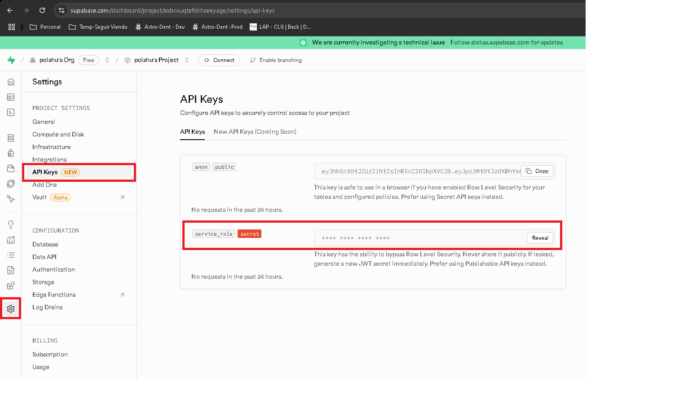
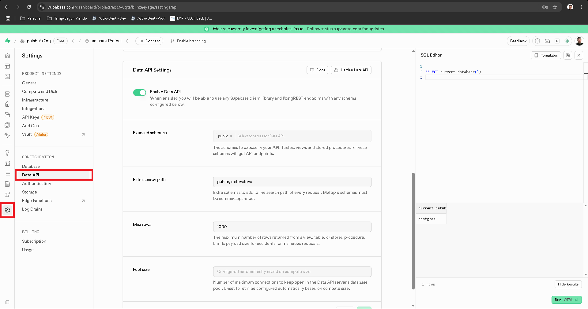

# ACCEDIENDO A POSTGRESQL
Vamos a crear una aplicacion de prueba para poder acceder al motor de base de datos PostgreSQL y realizar un CRUD (`C`reate, `R`ead, `U`pdate y `D`elete)

La base de datos `DAI-2025` va a tener una 4 tablas `alumnos`, `alumnos_grupos_pdp`, `grupos_pdp` y `cursos` con las siguientes columnas. 



## Archivos de base de datos

Se puede descargar e importar el script de creación y carga de datos desde el siguiente link:

Script de PostgreSQL `documents/database/script-postgress.sql`.

## Archivos de POSTMAN

Se puede descargar e importar el script de prueba desde POSTMAN desde el siguiente link:

Script de PostgreSQL `documents/postman/DAI - 2025 - EXPRESS y PG - ALUMNOS.postman_collection.sql`.

## REQUISITOS
Es necesario instalar las siguiente bibliotecas:

- [NPM](https://www.npmjs.com/) Node Package Manager (versión 8.6.0 o superior)

    ```doscon
    npm install cors
    npm install express
    npm install pg
    ```
        
- Si queres hacer las cosas aun mejor, que sea mas legible en codigo y no tener que reiniciar el node en cada modificacion, te conviene instalar esto:
    ```doscon
    npm install nodemon
    ```

    y en el package.json modifica esta linea
    ```json
    "scripts": {
        "server"   : "node src/server.js"
    },
    ```
    por esto
    ```json
    "scripts": {
        "server"   : "nodemon src/server.js"
    },
    ```


- Si queres hacer el codigo de respuesta mas legible y poner `StatusCodes.OK` en vez de `200`, te conviene instalar esto:
    ```doscon
    npm install http-status-codes
    ```
    

## MEJORAS
Vamos a realizar varias mejoras partiendo de la version inicial. Modificando y encapsulando codigo, optimizando codigo y refactorizando codigo.

- Version 00: 
    - Middlewares de cors() y express.json()
    - Todos los endpoints (de alumnos y cursos) en el mismo archivo.
    - Try/catch/finally para manejo de errores.
    - Status de respuesta legible (utilizando `http-status-codes`).
    - Utilizamos nodemon para que reinicie automaticamente al cambiar algo.

- Version 01: 
    - Eliminamos la biblioteca `pg`.
    - Agregamos la biblioteca `@supabase/supabase-js`.
        ```doscon
        npm install @supabase/supabase-js
        ```

        ```javascript
        import supabase from './supabaseClient.js';
        ```
    - Utilizamos la biblioteca `dotenv` para poder sacar de codigo fuente variables de configuracion de la aplicacion.    
    Por ejemplo rutas, puertos, datos de conexion al servidor de PotsgreSQL, etc..
        ```doscon
        npm install dotenv
        ```
    
        ```javascript
        import 'dotenv/config'
        ```

        Archivo .env en el raiz del proyecto
        ```bash
        # SUPABASE
        SUPABASE_URL=https://xyxyxyxyxyxyxyxyxyxy.supabase.co
        SUPABASE_SERVICE_ROLE_KEY=eyJhbGciO.....
        ```

- Version 02: 
    - Utilizamos la biblioteca `pg`. (continuamos con la version inicial)
    - Utilizamos la biblioteca `dotenv` y hacemos mejoras al archivo .env por ejemplo el `??` y el `PORT` del servidor express.
    Por ejemplo rutas, puertos, datos de conexion al servidor de PotsgreSQL, etc..
        ```doscon
        npm install dotenv
        ```

        ```javascript
        import 'dotenv/config'
        ```

        Archivo .env en el raiz del proyecto
        ```bash
        # Variable para acceder a POSTGRESS (LOCAL)
        DB_HOST		    = "localhost"
        DB_DATABASE		= "dai-2025"
        DB_USER    		= "postgres"
        DB_PASSWORD		= "root"
        DB_PORT         = 5432
        ```

        Archivo /src/db-config.js
        ```javascript
        const DBConfig = {
            host        : process.env.DB_HOST       ?? '',
            database    : process.env.DB_DATABASE   ?? '',
            user        : process.env.DB_USER       ?? '',
            password    : process.env.DB_PASSWORD   ?? '',
            port        : process.env.DB_PORT       ?? 5432
        }

        export default DBConfig;
        ```
        
        El operador `??` en JavaScript (y por lo tanto en Node.js) se llama operador de fusión nula (nullish coalescing operator). Sirve para proporcionar un valor por defecto solo cuando el valor a la izquierda es `null` o `undefined`.

    - Try/catch separado tanto para la **conexion**, como la **ejecucion** y tambien el **cierre** de la conexion con la base de datos.

- Version 03: 
    - Se reemplaza la apertura y cierre del `Client`, por un conexion persistente `Pool`, que es lo ideal en las APIs y alta concurrencia de requests.
        ```javascript
        const pool = new Pool(config);
        ```
    - Se achica el codigo de los endpoints.
    - Se hacen menos Try/catch y se elimina el finally.

- Version 04: 
    - **Middlewares**: Se separan los endpoints en diferentes `Router` de express y se ponen en la carpeta `/src/controllers`.
        ```javascript
        import AlumnosRouter    from "./controllers/alumnos-controller.js"
        import CursosRouter     from "./controllers/cursos-controller.js"
        ...
        ...
        // Endpoints (todos los Routers)
        app.use("/api/alumnos", AlumnosRouter);
        app.use("/api/cursos" , CursosRouter);
        ```
    - Los endpoints estan agrupados por funcionalidad (o tabla).
    - Se achica el programa principal, y se montan las rutas con un prefijo.
    - Es muy facil cambiar las rutas de ubicacion, por ejemplo `/alumnos` por `/api/students`.
    - Se pueden modificar los archivos independientemente y tenemos menos conflictos con el manejo de versionado (GIT).
    - Se elimina del programa principal todo lo que tiene que ver con acceso a base de datos.


- Version 05: 
    - Se modifico la arquitectura de la aplicacion:
        - **controllers**: Son los que atajan la solicitud (`req`) y luego de enviarlo al servicio correspondiente devuelven los datos y su status (`res`).
        - **services**: Son los que tienen la logica, en general es un pasamanos hacia el repository, pero muchas veces se valida ahi la logica de negocio. Por ejemplo si hay stock, si hay que hacer algo antes de ejecutar un metodo, si luego de ejecutarlo hay que hacer otra cosa por ejemplo enviar un email, o invocar a otro servicio.
        - **repositories**: Son los que acceden a los datos, concen los nombres de las tablas, los campos, los parametros a los stored procedures, saben de string de conexiones, timeouts, etc...
    - Se creo la clase `log-helper.js` en siguiente carpeta `/src/helpers/` con el objetivo de guardar en un archivo los errores que se producen. La configuracion de donde se debe crear este archivo se encuentra en el archivo `.env`
        ```javascript
        getAllAsync = async () => {
            console.log(`AlumnosRepository.getAllAsync()`);
            let returnArray = null;
            
            try {
                const sql = `SELECT * FROM alumnos`;
                const resultPg = await pool.query(sql);
                returnArray = resultPg.rows;
            } catch (error) {
                LogHelper.logError(error);
            }
            return returnArray;
        }
        ```

- Version 06: 
    - Se modifico la parte del repository para utilizar supabase client.

        https://supabase.com/docs/reference/javascript/select

        ```doscon
        npm install @supabase/supabase-js
        ```

        ```javascript
        import supabase from './supabaseClient.js';
        ```
    - Se modificaron el  `alumnos-repository.js` y `cursos-repository.js` para que utilice la biblioteca de Supabase Client `'@supabase/supabase-js'`.

        Archivo supabaseClient.js
        ```javascript
        import 'dotenv/config';
        import { createClient } from '@supabase/supabase-js';

        const supabase = createClient(
            process.env.SUPABASE_URL,
            process.env.SUPABASE_SERVICE_ROLE_KEY
        );
        export default supabase;
        ```

        Archivo alumnos-repository.js
        ```javascript
        import supabase     from './supabaseClient.js';
        ...
        ...
        getAllAsync = async () => {
            let returnArray = null;

            try {
                const { data, error } = await supabase.from('alumnos').select('*');
                if (!error) {
                    returnArray = data;
                } else {
                    LogHelper.logError(error);
                }
            } catch (error) {
                LogHelper.logError(error);
            }
            return returnArray;
        }
        ```

    - Configuraciones
    
    settings -> Base de datos
    
    settings -> API Keys
    
    settings ->Enable DATA API
    
    
