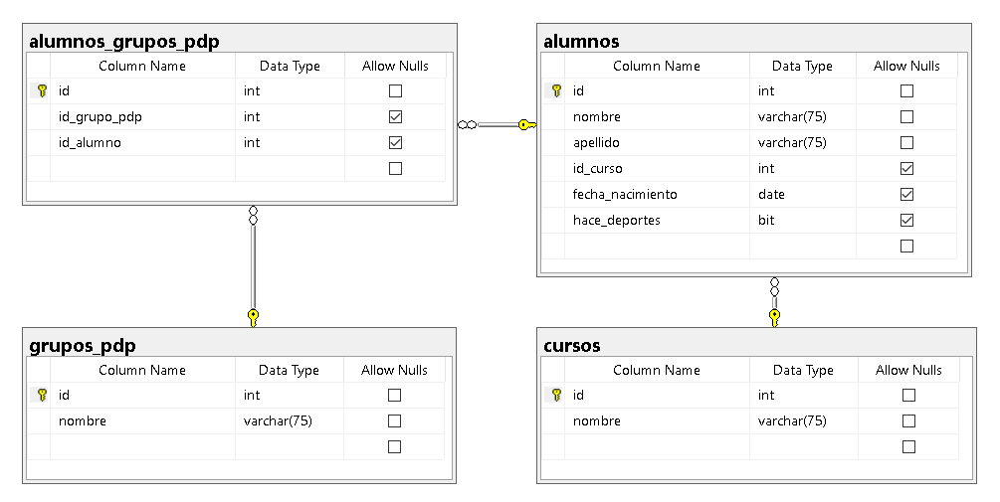

# REPASANDO SQL
El objetivo es hacer consultas sonbra una base de datos y recordar la sintaxis basica.

La base de datos `DAI-2025` va a tener una 4 tablas `alumnos`, `alumnos_grupos_pdp`, `grupos_pdp` y `cursos` con las siguientes columnas. 




## Archivos de base de datos

Se puede descargar el script de creación y carga de datos desde el siguiente link:

Script de Sql Server [script-mssql.sql](script-mssql.sql) o script de PostgreSQL [script-postgress.sql](script-postgress.sql).

## Ejercicios
Este es un ejemplo de un ejercicio:
- Ejemplo:

    ```sql
    SELECT * 
    FROM alumnos
    ```

1. Obtener todos los alumnos. (121 rows)
2. Obtener el nombre y el apellido de todos los alumnos. (121 rows)
3. Obtener el nombre, apellido y fecha de nacimiento de todos los alumnos, ordenada por fecha de nacimiento. (121 rows)
4. Obtener el apellido y nombre de todos los alumnos que NO tienen una fecha de nacimiento, ordenado por apellido y luego por nombre. (13 rows)
5. Obtener el fecha de nacimiento, apellido y nombre de todos los alumnos que SÍ tienen una fecha de nacimiento, ordenado por fecha de nacimiento y luego por apellido. (108 rows)
6. Obtener todos los nombres de los alumnos ordenado por nombre. (121 rows)
7. Obtener todos los nombres únicos de los alumnos ordenado por nombre. (113 rows)
8. Obtener todos los alumnos que tienen una letra 'a' en el apellido. (68 rows)
9. Obtener todos los alumnos que su nombre termina con una letra 'n'. (26 rows)
10. Obtener todos los alumnos que hacen deporte. (52 rows)
11. Obtener todos los alumnos que NO hacen deporte y su apellido comienza con un a'M'. (8 rows)
12. Obtener la Primer letra del nombre (nombre de columna 'Inicial') y el apellido de todos los alumnos ordenado por apellido. (121 rows)
13. Obtener todos los alumnos cuya segunda letra del nombre es una 'a'. (34 rows) 
14. Obtener todos los alumnos que nacieron en el 2007. (59 rows)
15. Obtener todos los alumnos que cumplen en MAYO y hacen deportes. (4 rows) 
16. Obtener todos los alumnos que cumplen el dia 8 de algun mes y no hacen deportes. (4 rows) 
17. Obtener el nombre, apellido y concatenar las primeras dos letras del nombre y las últimas dos letras del apellido y juntarlas todas en un columna que se llame 'clave'.(121 rows) 
18. Obtener el nombre, apellido y la longitud del nombre (columna 'longitud') y ordenarlos por la longitud del nombre descendentemente. (121 rows) 
19. Obtener el nombre, apellido y reemplazar la letra 'o' por un '0' del nombre (columna 'clave'). (121 rows) 
20. Obtener el nombre, la cantidad de veces que se repite (columna 'QTY'). (113 rows) 
21. Lo mismo que el punto (20) pero ordenado por QTY Descendente. (113 rows) 
22. Lo mismo que el punto (20) pero solo los que tienen repetidos. (6 rows) 
23. Lo mismo que el punto (20) pero solo los primeros 3 registros. (3 rows) 
24. Nombre, apellido y nombre del curso de todos los alumnos. (121 rows) 
25. Nombre del curso y cantidad de alumnos por curso (columna 'QTY'). (4 rows) 
26. Nombre del curso y cantidad de alumnos por curso (columna 'QTY'), de los cursos que tienen más de 30 alumnos. (2 rows) 
27. Nombre y apellido de los alumnos, y nombre del grupo al que pertenece. Ordenado por nombre del grupo. (112 rows) 
Fijarse por que no aparecen 9 alumnos!!!
28. Nombre y apellido de los alumnos, y nombre del grupo al que pertenece. Ordenado por nombre del grupo. (121 rows) 
Aunque no tengan grupo asignado
29. Nombre y apellido de los alumnos, que no tienen grupos asignados. (9 rows) 


